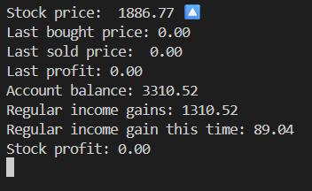
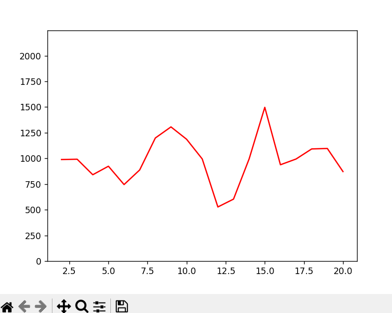

A text-based **stock profit simulation game** made using Python. 
Buy and sell at the right moments using a command-line price reference and a graph of recent stock price history.
Built using matplotlib and Python’s randomisation modules.

## Features
- Dual randomiser system (rough + fine volatility)  
- Live stock-price graph showing recent trends  
- Buy and sell options
- Regular income, stock profit and total income tracker
- Edge-case handling to keep markets realistic

## Command line output

The command-line output updates every 2 seconds, showing the live values of all the variables shown above.

## Graph output

The graph updates after every price change, plotting the recent history (last 20 changes) of the stock price

